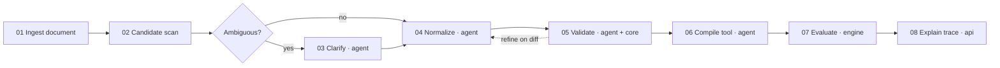
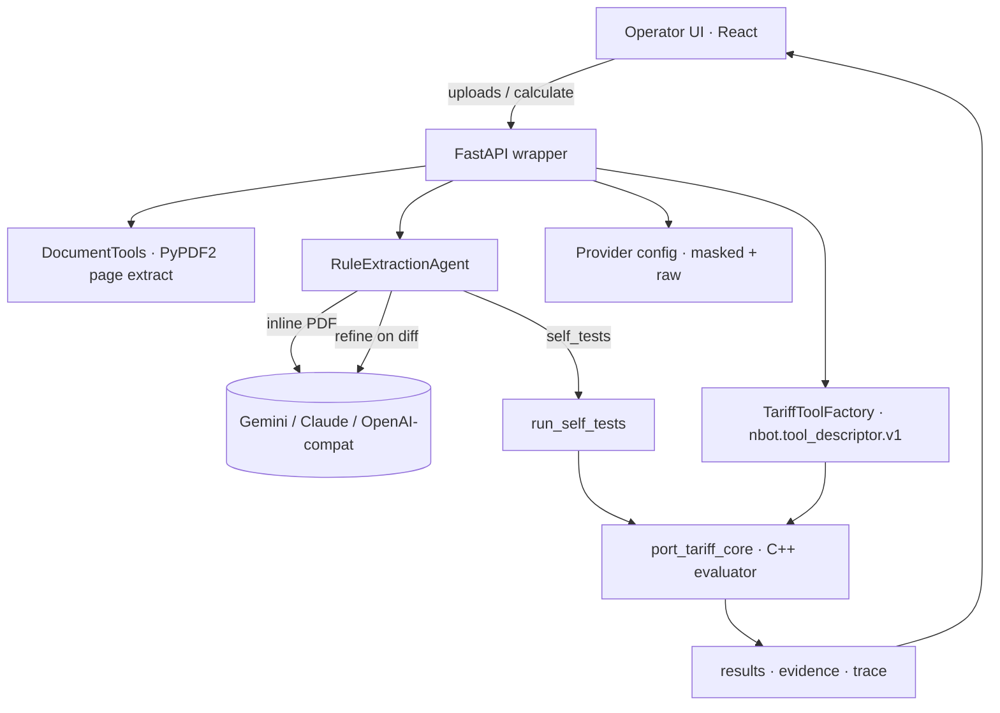

# Port Tariff Agent — User Flow & Architecture

A general-purpose port tariff calculator. Upload a tariff PDF for any port (South Africa, Rotterdam, Singapore, Los Angeles, Melbourne, Sohar, etc.); an LLM agent reads the document natively, extracts rule logic into a portable rule pack, validates it against worked examples it found in the document, and exposes a deterministic calculator tool. Vessel facts in → totals + evidence + execution trace out.

## Validated proof point

**Port of Rotterdam — Port Tariffs 2026, Annex 2 Example 4** reproduces to the cent through the agent pipeline:

| Stage | Value | Source |
|---|---:|---|
| Vessel component (Container Deepsea, 75,246 GT × €0.151) | €11,362.15 | Annex 1 Table 1 row E |
| Cargo component (Containers Deepsea, 15,000 t × €0.562) | €8,430.00 | Annex 1 Table 2 row 09 (Deepsea) |
| Sustainability component (75,246 GT × €0.067) | €5,041.48 | Annex 1 Table 3 row E |
| ESI 31–40 discount (−60% × sustainability) | −€3,024.89 | Annex 1 §1.4(B) |
| **Calculator total** | **€21,808.74** | matches Annex 2 Example 4 (PDF page 20) |

The rule pack producing this total was generated by Claude (`claude-sonnet-4-6`) reading the 25-page Rotterdam PDF natively in a single call (~4m38s, 106 rules extracted, zero rules dropped). The PoC ships **no** port-specific data — every number above came out of the agent + C++ pipeline running against the freshly uploaded PDF.

`scripts/validate_rotterdam_examples.py` runs this and the other Annex 2 examples as a regression harness.

## Design boundary

The split is intentional and load-bearing for the demo:

- **LLM agents** read documents and emit `port_tariff.rule_pack.v1` JSON. They are the only component that calls a model.
- **C++ core** (`port_tariff_core`) evaluates rule packs deterministically: match conditions, evaluate the formula DSL, sum amounts, emit per-charge results + skipped-rules + plan graph. No models, no network I/O, no hidden state. Same rule pack + same vessel JSON → same totals, every time.
- **Rule packs are data**, never source code. The repository ships zero port-specific rates. A new port = a new uploaded PDF = a new generated rule pack. Same evaluator handles them all.
- **Providers are interchangeable.** Gemini, Claude, and OpenAI-compatible endpoints are tried in order with automatic fallback. Switching providers is a config change, not a code change.

## End-user flow

1. **Configure a provider.** Open Settings (gear icon top-right), paste a Gemini and/or Anthropic API key. Keys persist to `.runtime/model_providers.local.json`. Either env var (`GEMINI_API_KEY`, `ANTHROPIC_API_KEY`) is also picked up automatically.
2. **Upload a tariff PDF.** The app shows a live progress pill ("Extracting rules from `xxx.pdf` · 1:23 elapsed") while the model reads the document. Typical times: 60–120s for Claude on a 25-page PDF, 90–240s for Gemini on the same.
3. **Watch the agent pipeline animate.** Eight stages: ingest → candidate scan → optional clarify → normalize → validate → compile tool → evaluate → explain. Each stage shows owner badge (`tool` / `agent` / `engine` / `api`) and live status (idle, running, done, warn, error).
4. **Self-tests run automatically.** If the model extracted any worked examples from the document, the calculator immediately runs them. The candidate-extract panel shows pass/fail (`Self-tests passed (4/4)` or `Refinement closed 2 of 3 gaps`).
5. **Calculate.** Edit vessel facts in the structured form (vessel type, GT, cargo lines, ESI, Green Award) or paste raw JSON for advanced fields. Press Calculate. Pipeline animates stages 7–8.
6. **Inspect results.** Each charge row shows amount, confidence, evidence page links, and a reason summary. Click any pipeline stage to inspect what it produced.
7. **Switch ports.** Each successful upload creates a "known port" entry; switch via the dropdown without re-uploading.

## Agent graph



Stages 1–6 build the calculator (no vessel data needed). Stages 7–8 run a vessel through the compiled tool. Pipeline animation is scoped per action: upload triggers 1–6, calculate triggers 7–8.

## Stage details

| # | Stage | Owner | What it produces |
|---|---|---|---|
| 01 | Ingest document | tool | Page text via PyPDF2, source_id (sha16), page-link URLs |
| 02 | Candidate extract | agent | Lightweight signal scan on the page text (charge name keywords) |
| 03 | Research / clarify | agent | Optional model lookup for ambiguous terms; records dispatch only |
| 04 | Rule normalize | agent | `port_tariff.rule_pack.v1` + `self_tests` from worked examples |
| 05 | Validate | agent + core | C++ schema check; per-rule lenient drop with `extraction_warnings` |
| 06 | Compile tool | agent | `nbot.tool_descriptor.v1` with `x-required_fact_paths` derived from rule formulas |
| 07 | Evaluate | engine | Deterministic rule matching + formula evaluation |
| 08 | Explain trace | api | Bind evidence pages, confidence, graph nodes to result rows |

## Native PDF input

PyPDF2 text extraction mangles the column structure of dense rate tables — the very thing tariff documents rely on. So when the chosen provider supports multimodal PDF input (Gemini, Claude), the upload handler sends the raw PDF bytes inline (base64). For Gemini that's a `parts[].inline_data` with `mime_type: application/pdf`; for Claude that's a `content[].document` block. The model sees the original tables, including spanning headers and footnotes.

For very large PDFs (over the inline limit — 20 MB Gemini, 32 MB Claude) the extractor falls back to text mode using PyPDF2 + page selection. None of the documents we've tested approach those limits.

## Multi-provider fallback

`RuleExtractionAgent.extract()` builds an ordered list of eligible providers (default first, then others), each filtered to `enabled` + has a key (or env-fallback). It walks the list:

1. Build the appropriate prompt (PDF-native or page-text).
2. Call the provider with a 5-minute socket timeout.
3. Parse + sanitise the response. Strip raw control chars from string literals. If JSON is truncated mid-rule, close the rules array at the last complete object and salvage.
4. Lenient validate: drop rules with unsupported ops (e.g. `ne`, `regex`) into `extraction_warnings`, keep the rest.
5. If everything failed (timeout, invalid JSON, empty pack, all rules dropped), record the attempt and try the next provider.

The response surfaces all attempts so failure modes are visible: `attempts: [{provider, input_mode, error}]`.

## Self-test refinement loop

Many tariff documents include worked examples (Annex 2 in Rotterdam, validation tables in SA Tariff). The agent is instructed to extract these as `self_tests`:

```json
{
  "self_tests": [
    {
      "name": "Annex 2 Example 4 — Container Deepsea",
      "vessel": { "technical_specs": { ... }, "operational_data": { ... } },
      "expected_total": 21808.74,
      "expected_charges": [{ "rule_id_or_charge_name": "Vessel component", "amount": 11362.15 }],
      "evidence": { "page": 20 }
    }
  ]
}
```

After successful extraction + activation, every self-test runs through the C++ core. For each test where `|actual − expected| > €1`, a refinement prompt is built:

```
You produced this rule pack from the attached tariff document, but its self_tests
do not match expected totals. Identify the missing or wrong rules, fix them, and
return the COMPLETE corrected port_tariff.rule_pack.v1 JSON.

FAILING SELF-TESTS WITH DIFFS: [...]
ORIGINAL RULE PACK: [...]
```

The provider (with native PDF still attached) returns a corrected pack. The C++ core validates it again; on success the new pack replaces the original and self-tests re-run. The result is one of:

- `passed` — all self-tests within €1 of expected, no refinement needed.
- `refined_partial` — refinement closed some gaps but not all (surface the residual diffs to the operator).
- `refine_validation_failed` — refined pack didn't pass C++ validation; original stays active.

The loop is single-pass. For very ambiguous documents, additional manual refinement triggers can be added — but the operator should also consider whether the document itself needs a clarification step (stage 03).

Why "agentic"? The model uses its own output's behaviour against ground truth (the document's own worked examples) as feedback to correct itself, with the deterministic core as the ground-truth oracle. The architecture treats the LLM as a fallible extraction tool, not an authority.

## Architecture



### Layers

- **React UI** (`web/`) — operator console, agent pipeline visualisation, vessel calculator form, settings drawer.
- **FastAPI wrapper** (`api/port_tariff_agent/server.py`) — orchestrates uploads, agents, providers, tool descriptors, validation, refinement.
- **Agents** (`api/port_tariff_agent/agents/`) — `RuleExtractionAgent` (extract + refine), `ResearchAgent` (clarify dispatcher).
- **Tools** (`api/port_tariff_agent/tools/`) — `DocumentTools` (PDF extraction, RAG packet builder), `TariffToolFactory` (rule pack → tool descriptor), `ResearchTools`.
- **C++ core** (`core/src/`) — `CoreCli` (process boundary), `TariffEngine` (orchestrator), `RuleMatcher`, `FormulaEvaluator`, `PlanGraph`, `JsonUtil`. Statically linked, single binary, deterministic.

### Process boundary

Python ↔ C++ is JSON over CLI. `server.py::run_core(mode, payload)` invokes `port_tariff_core --mode {health|rules|models|plan|validate-rule-pack|calculate} --input <tempfile>` and parses stdout. No FFI, no shared memory, no IPC daemon. This makes the core easy to fuzz, replace, or run as a satellite.

## Rule pack contract

`port_tariff.rule_pack.v1`:

- **`document`** — `currency`, `title`, `source`, `jurisdiction`, optional `vat_note`.
- **`rules`** — array of charge rules. Each: `id`, `charge_name`, `category`, `applicability` (array of conditions), `formula` (DSL tree), `evidence` (page + quote), `confidence` (0–1), optional `notes`.
- **`self_tests`** — array of `{name, vessel, expected_total, expected_charges?, evidence}` for the refinement loop.

**Formula DSL:** `const`, `var`, `add`, `subtract`, `multiply`, `divide`, `ceil_div`, `max`, `min`, `coalesce`. Path syntax for `var` is dotted (`technical_specs.gross_tonnage`).

**Applicability ops:** `eq_ci`, `in_ci`, `exists`, `>`, `>=`, `<`, `<=`, `==`/`eq`. Case-insensitive for strings.

The deterministic core executes independent payable rules and sums amounts (negative values are valid — that's how cap discounts work). It does not support inter-rule references; every `var` must read input vessel facts.

## Generalisation strategy

To handle a new port:

1. Upload the tariff PDF. No code changes.
2. Watch extraction → self-test → refinement complete.
3. If self-tests pass: calculator is ready, switch to it via the Known ports dropdown.
4. If self-tests partially fail: review diffs in the candidate-extract panel. Common causes: missing derived discounts (caps, exemptions), slug inconsistency between vessel and cargo rules, ambiguous prose. Either trigger another extraction pass or refine the prompt.
5. The compiled tool descriptor exposes `x-required_fact_paths` derived from rule formulas — the UI uses this to know what vessel fields the rule pack needs.

## Known limitations

- **Single-cargo per call.** Some rule packs (e.g. Rotterdam) use a scalar `cargo_tonnes` + categorical `cargo_type_*`, which means a vessel with two cargo types needs two calls. A future schema bump can support a `cargo: [{type, tonnes}]` array; the formula DSL would need a `sum_over` op.
- **Refinement is single-pass.** Complex tariffs with many derived rules may need multiple iterations. Add a manual "Refine again" trigger if needed.
- **PDF native input requires the provider to support it.** Local OpenAI-compatible models fall back to PyPDF2 page text, which loses table structure.
- **Confidence scores are model-self-reported.** Treat as a hint, not a guarantee. The deterministic core ignores confidence; it just evaluates whatever rules match.

## Demo success criteria

- A non-engineer can run the demo end-to-end without touching code.
- Provider configuration is in the UI, not in env files.
- Uploading a never-seen tariff produces a working calculator within 5 minutes (one provider attempt + at most one refinement).
- Worked examples from the document round-trip — extraction → calculation → match — for at least one published example.
- The application ships no port-specific tariff data as default state.
- Every charge result includes amount, evidence page, confidence, and execution trace.
- Provider, prompt, and core are independently swappable.
